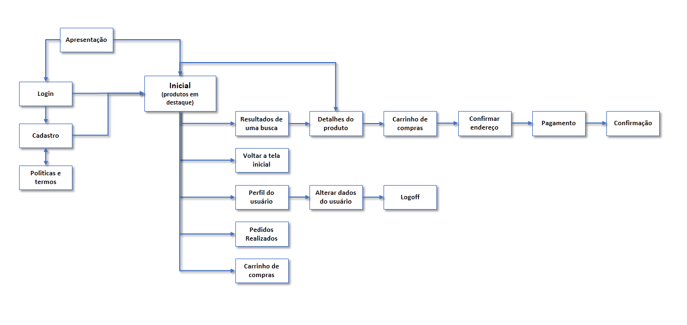

| Diretório | Descrição |
| ------ | ------ |
| [\config](https://github.com/FelipeGalvao1/app-loja-php/tree/master/config) | Responsável por guarda o arquivo de configuração do projeto que faz comunicação com o banco de dados |
| [\db](https://github.com/FelipeGalvao1/app-loja-php/tree/master/db) | Script do banco de dados e relacionamento |
| [\domain](https://github.com/FelipeGalvao1/app-loja-php/tree/master/domain) | Responsável por guardar as funções do CRUD para cada tabela |
| [\service](https://github.com/FelipeGalvao1/app-loja-php/tree/master/service/) | Onde é guardado a parte de transformação de dados |

# Fluxo do Aplicativo
